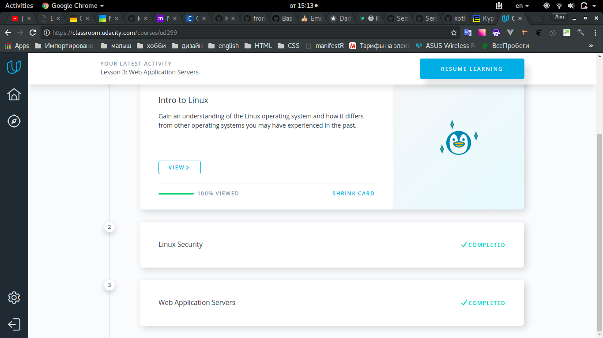
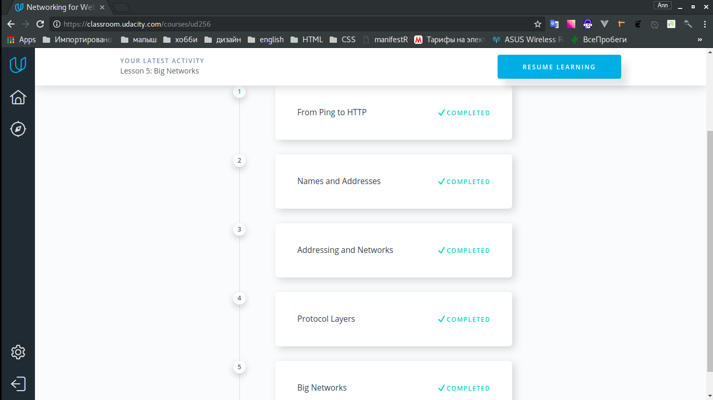
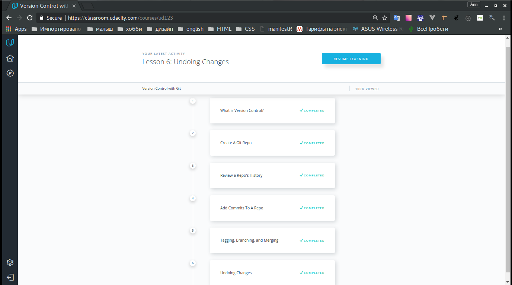

## Task_0
> I refreshed my knowledge about Git. New thing for me is 'pull request' (need more practice with it).
Also interesting was working directory and staging area (finally I understand how it works, thanks girls from Udacity).
## Task_1
### 1.1 Linux Command Line Basics

### 1.2 Configuring Linux Web Servers

### 1.3 Networking for Web Developers

## Task_2

