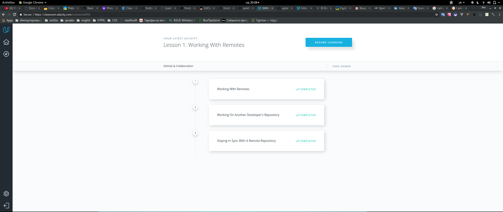
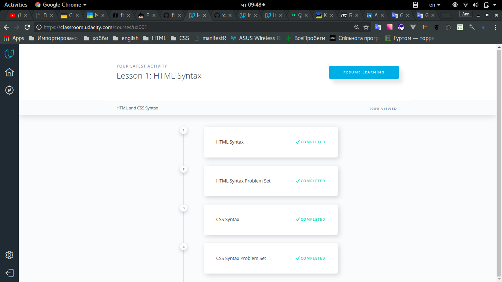
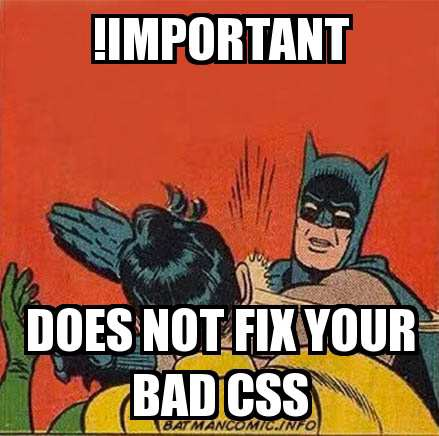
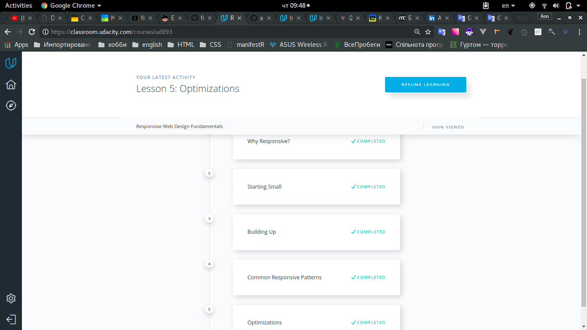
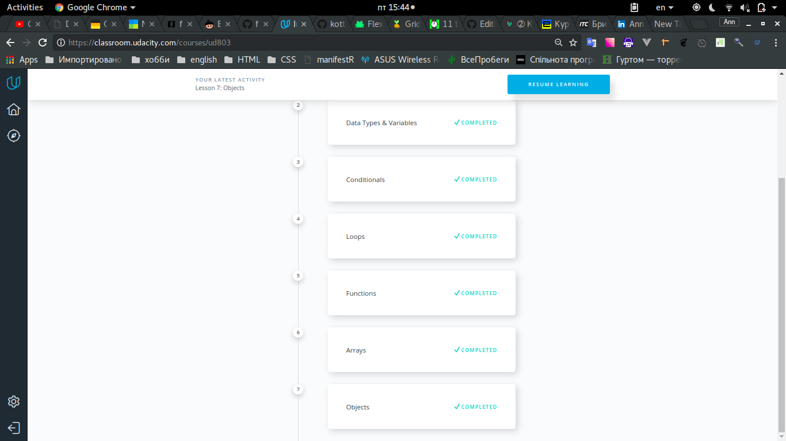

## Task_0
> I refreshed my knowledge about Git. New thing for me is 'pull request' (need more practice with it).
Also interesting was working directory and staging area (finally I understand how it works, thanks girls from Udacity).
## Task_1
### 1.1 Linux Command Line Basics
- ok
- 
### 1.2 Configuring Linux Web Servers
- I was impressed with vagrant, the way to manage virtual machines.
- 
### 1.3 Networking for Web Developers
- I become more aware of networking. All the information was new to me
- 
## Task_2
### 2.0 Version Control with Git
- "tag" in Git - something new
- one thing you intend to use in the future - write commits correctly
- 
### 2.1 GitHub & Collaboration
- 
## Task_3
- Ctrl+O, Ctrl+R in browser -AWESOME!!!
- CSS selectors ('+', '~'), pseudo-elements (::selection), HSLA(hue, saturation, lightness, alpha channel) in background-color etc.
- 
## Task_4
#### Something new:
- [device pixel ratio](https://stackoverflow.com/questions/8785643/what-exactly-is-device-pixel-ratio) (logical pixels
(Device Independent Pixels. example:'1600px') + physical pixels(Hardware Pixels. ex:'800px') = device pixel ratio '2'), device-aspect-ratio.
- simulators, emulators (mobile debugging using the development tools on a desktop machine)
- CSS: resolution, orientation
- font boosting
#### Surprised:
- the instructor of the course has a good low voice timbre. it was nice listening
#### Thing you intend to use in the future:
- Try not to use !important
- 
- 
## Task_5
- I always were confusing which logical operation gives true ( && or || ) when one of the argument is false. Now I cleary know it :)
- Notes: 
```
condition ? ( do this if TRUE ) : ( do that if FALSE);

for ( start; stop; step ) {
  // do this thing
}

```
-It was hard but fantastic, especially when I stuck at task "triangle". but after 2 hour it shown me really happiness. The next tasks were easily. It is one of the best course.
- 
