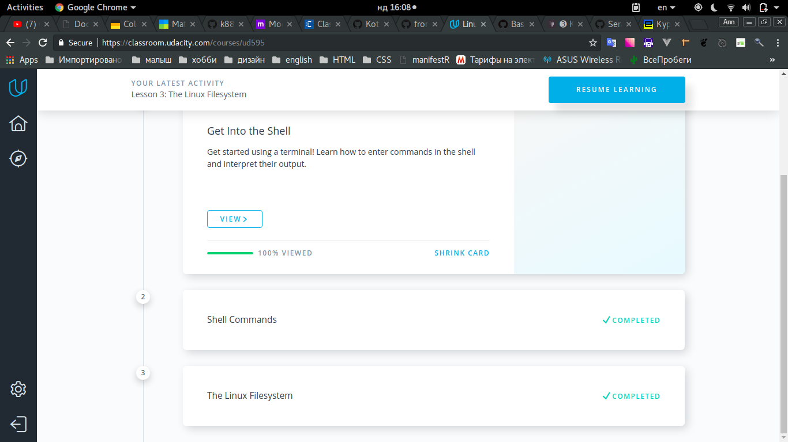

## Test_0
> I refreshed my knowledge about Git. New thing for me is 'pull request' (need more practice with it).
Also interesting was working directory and staging area (finally I understand how it works, thanks girls from Udacity).
## Test_1
### 1.1 Linux Command Line Basics
>
